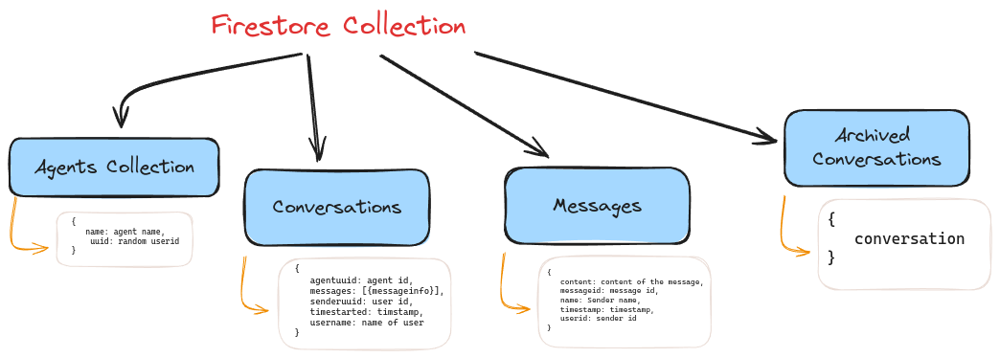
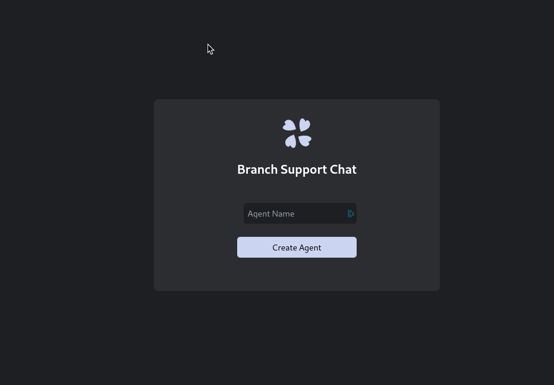
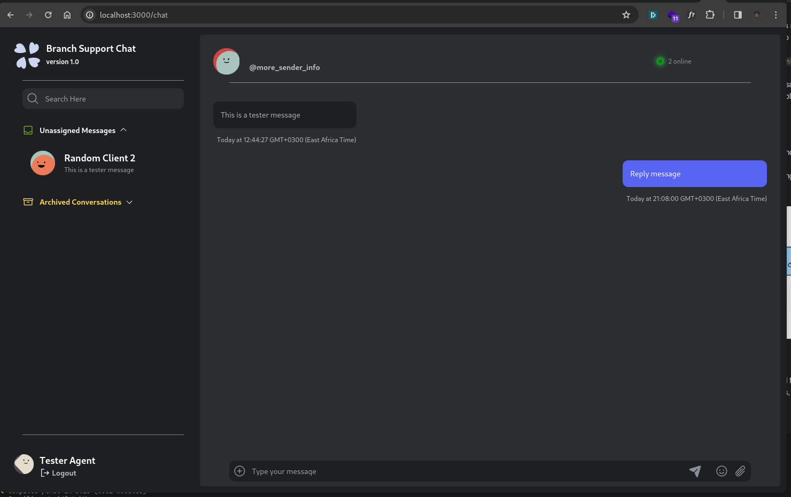

# CSMessagingWebApp

A messaging web application built as a take away assignment for Branch International Junior Backend Role.

## Key Facets

### 1. Agents

- Agents are created using a name only. This creates a new record in the database with the following fields:\
  `name:Agent Name`, \
  `uuid:Unique Agent Identification`,\
  `isOccupied:A boolean to indicate weather the agent is free or not`
- Agents can be attached to one or many conversations
- Agents are destroyed on logout. Meaning they are no longer available for conversations. The messages that they sent will persist in the `archivedConversations` collection for non-repudiation.

### 2. Messaging

- Initially, a message will be unattached. Meaning that the sender exists but the recepient does not. A message will remain un attached until it is replied to be an Agent. At which point the message will evolve to become a conversation with two parties.
- The message will be deleted from the `Messages` collection and moved to the `Conversations` collection, using a union between `agentid` and `userid` as the referencing key.
- Message blocking was implemented by assigning conversations to separate agents. Conversations between an agent and a user is not visible from another agent's portal, thus removing the threat of a double assigned message.

### 3. Data Handling

- The inital csv that was part of the package was normalised and augmented using Python Pandas before being serialised and uploaded via an API endpoint.
- Data partaining to the app itself was stored in a [Document Database](https://firebase.google.com/). This allowed the fetching of realtime updates using Sockets.
- The schema is as follows:
  

### 4. User Interface and Serverless API

- The UI was built using Next JS and Tailwind and Next 14's [serverless functions](https://clouddevs.com/next/serverless-functions/#:~:text=full%2Dstack%20applications.-,NEXT.,need%20for%20separate%20backend%20services.). This allowed for some separation betwwn the backend and the render functions as most of the data, save for the realtime ones, were fetched from the serverless functions.

- Screenshots from the UI can be seen bellow:
  1. Agent creation page: 
  2. Chat sequence: 

All in all an interesting project.
